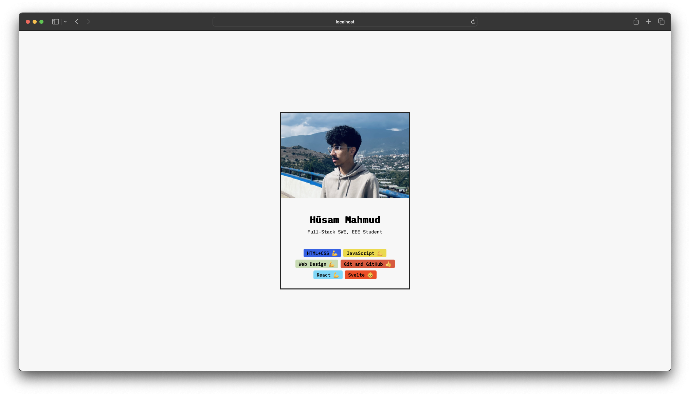
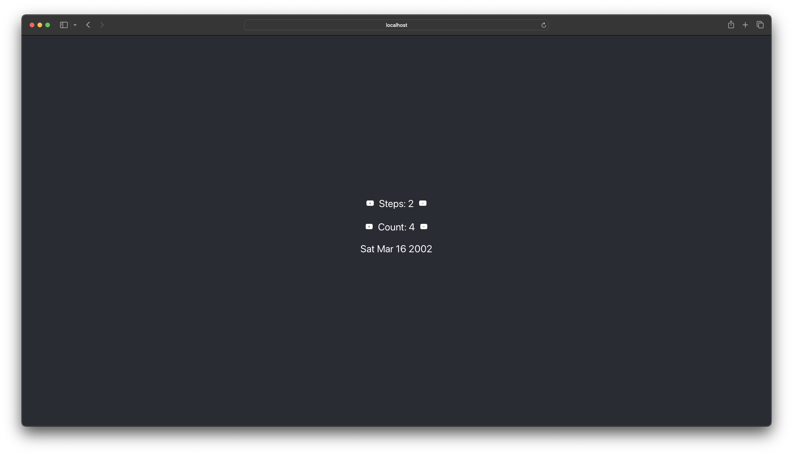
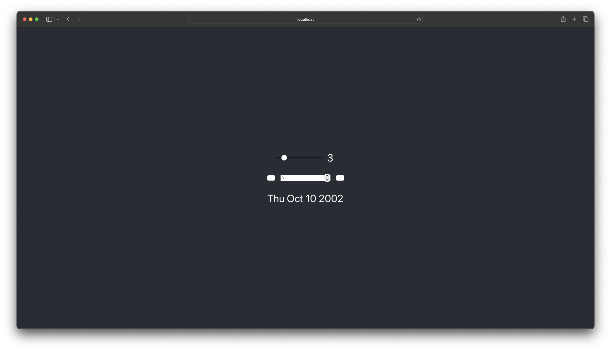
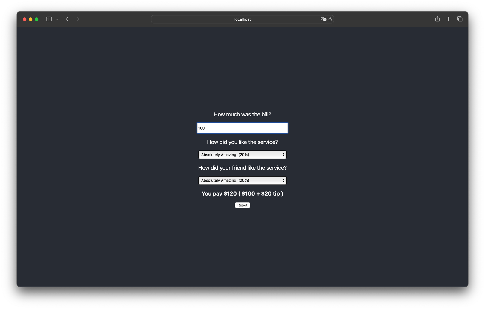
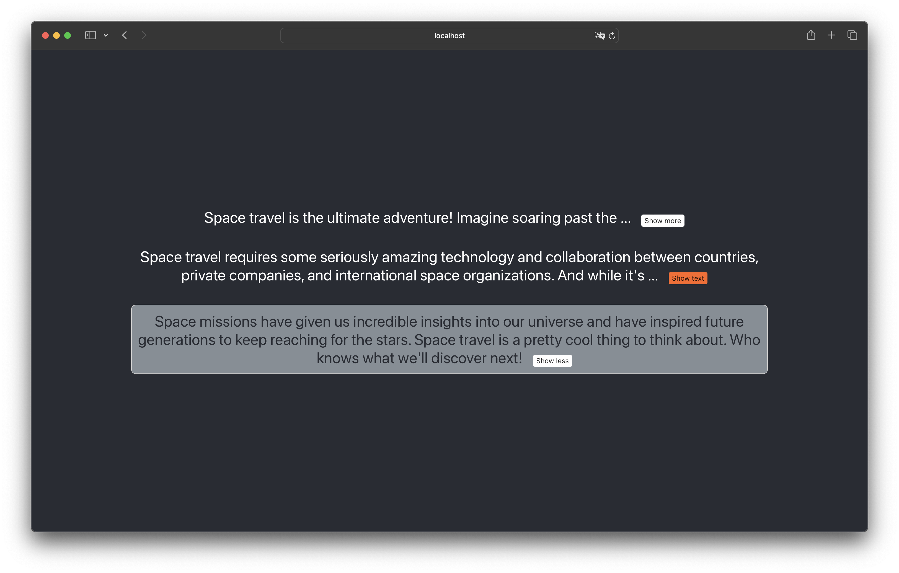
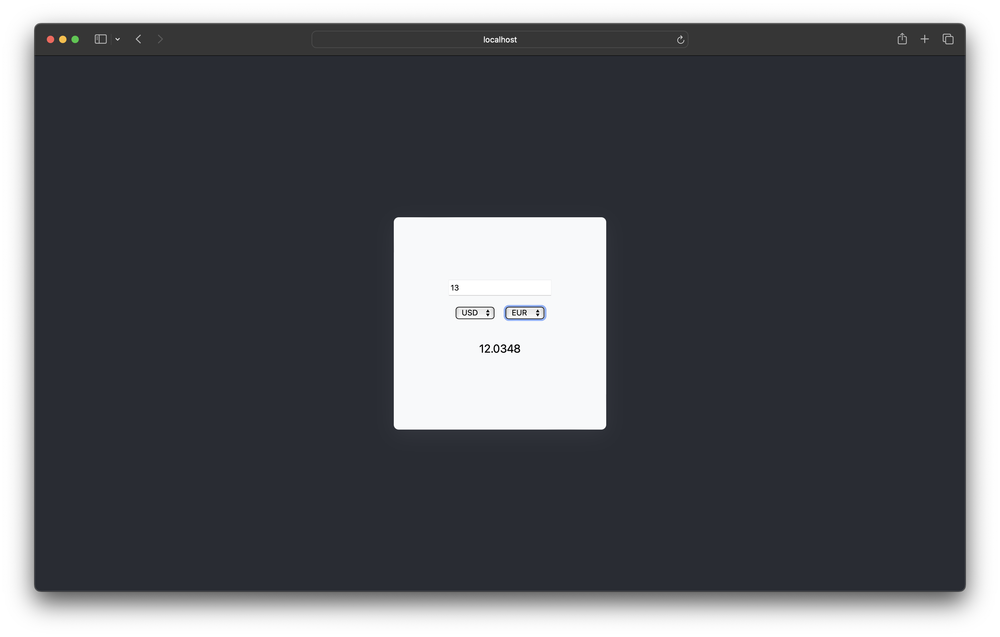
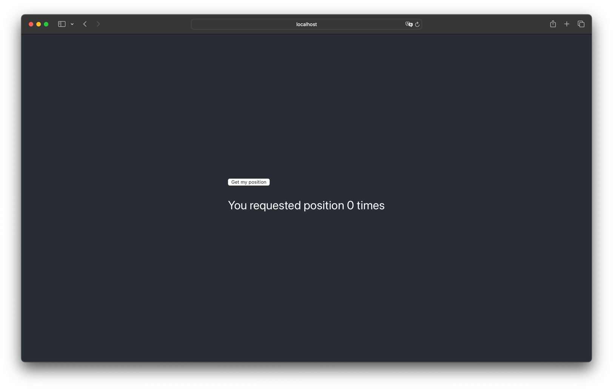

# The Ultimate React Course Challenges

    
Profile Card (v1)

    

    
Profile Card (v2)

    

    
Date Counter (v1)

    

    
Date Counter (v2)

    

    
Tip Calculator

    

    
Text Expander Component

    

    
Currency Converter

    

    
useGeolocate

    

